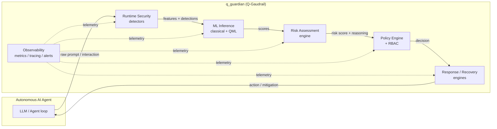

# 00. Project Overview — Q-Gaudrail

> **Document index:** this is document 00 of the Q-Gaudrail technical documentation set. See the table of contents in `README.md` for the full index of documents `00` through `18`.

## 1. What is Q-Gaudrail?

**Q-Gaudrail** (package name: `q_guardian`) is a **Hybrid Quantum-Classical Framework for Runtime Security of Autonomous AI Agents**. It is a Python 3.12+ framework that protects autonomous AI/LLM-driven agents by combining:

- **Classical machine learning** signal extraction (scikit-learn, XGBoost optional extras),
- **Quantum machine learning** models (Qiskit, Qiskit-Machine-Learning, Qiskit-Aer, PennyLane optional extras),
- **Runtime security pipelines** (prompt injection detection, prompt extraction, forbidden content, misdirection),
- **Risk assessment and policy engines** (policy DSLs, RBAC, composition, simulation),
- **Automated response / recovery / rollback** playbooks,
- **Full observability** (metrics, tracing, analytics, alerts, dashboards, OpenTelemetry and Prometheus exporters).

The project is a "guardian" layer that sits between an autonomous agent and its environment, continuously evaluating every interaction and deciding, with explainable reasoning, whether to **allow**, **warn**, **review**, or **block** it.

## 2. Version

| Field | Value |
|---|---|
| Package name | `q_guardian` |
| Version | `1.1.0` (declared in `pyproject.toml`) |
| Python requirement | `>=3.12` |
| License | MIT (see `LICENSE`) |
| Status | public release (v1.1.0), maintained on `main` branch |

## 3. Repository Location

- Root directory: `D:\Projects\Quantum\Q_Gaudrail`
- Primary package: `src/q_guardian/` (src layout, installed via `pyproject.toml`)

## 4. High-Level Architecture

The pipeline is, from first interaction to final decision:

1. **Runtime security detectors** (`security/`) analyze the raw prompt (normalize → feature extract → rules → classic ML → QML → hybrid fusion).
2. **Risk assessment** (`risk/`) computes a risk score, level, severity, decision and human-readable explanation.
3. **Policy engine** (`policy/`) applies RBAC, DSL adapters (Rego, Cedar, YAML, JSON), composition and simulation.
4. **Response engines** (`response/`) orchestrate allow/warn/review/block, quarantine, evidence, notifications, rollback and recovery.
5. **Observability** (`observability/`) records metrics, traces, analytics events and alerts; exports to OpenTelemetry / Prometheus.

## 5. Documented Scope

This documentation set was produced by reverse-engineering the repository as it exists on disk. It covers **495 tracked project files** (the canonical file listing is maintained in the docs' `01_Project_Structure.md` appendix). Every project file is documented exactly once across the set.

Explicit exclusions:

- `__pycache__` / `*.pyc` artifacts (build artifacts, not source),
- `.pytest_cache/` content (test-runner cache, auto-generated),
- `models/ml/` and `logs/` directories (present but effectively empty),
- virtual-environment and package-manager internals.

## 6. Key Numbers (quick snapshot)

Source of these figures: `01_Project_Structure.md` (canonical file inventory); test-function
counts per the test audit in `18_Tests_Scripts_Examples_Documentation.md`.

| Area | Files (non-`.pyc`) | Lines |
|---|---|---|
| `src/q_guardian/` (Python source) | 326 | 30,472 |
| `tests/` (Python tests) | 131 | 16,261 |
| `scripts/` | 29 (23 `.py`, 6 `.json`) | 3,996 |
| `examples/` | 13 | 2,382 |
| `docs/` (pre-existing user guides) | 17 | 5,710 |
| **Test functions** (per `agent_tests` audit) | — | 2,650 across 123 test files |

## 7. Feature Highlights

| Feature | Where | Notes |
|---|---|---|
| Hybrid classical+quantum ML | `ml/`, `quantum/` | QSVM, quantum kernels, hybrid fusion strategies |
| Runtime prompt security | `security/` | normalization, rules, feature extraction, `SecurityDecisionEngine` |
| Policy DSL adapters | `policy/adapters/` | Rego, Cedar, YAML, JSON adapters in one module |
| RBAC + policy composition | `policy/rbac/`, `policy/composition/` | role-based access control, composition & conflict detection |
| Risk assessment & explainability | `risk/` | scoring, SHAP-style/rule-based explanation |
| Response orchestration | `response/` | `ResponseEngine`, `OrchestrationEngine`, `RecoveryEngine`, `RollbackEngine`, `ApprovalEngine` |
| Observability | `observability/` | metrics, tracing, analytics, alerts, dashboards, exporters |
| External integrations | `response/integrations/`, `observability/integrations/` | Splunk, IBM QRadar, Prometheus, OpenTelemetry |
| Plugins & SDK | `plugins/`, `sdk/` | `Guardian` SDK, plugin registry/hooks |
| FastAPI service | `api/` | `/health`, `/system/version`, `/system/status` (v1 router) |

## 8. Data & Dependencies (declared)

Runtime dependencies (from `pyproject.toml` / `requirements.txt`):

- FastAPI, uvicorn (ASGI service),
- pydantic, pydantic-settings (settings/config),
- motor + pymongo (MongoDB persistence),
- structlog (structured logging),
- orjson (fast JSON),
- python-jose, passlib, python-multipart (auth/security),
- httpx (async HTTP),
- plus others listed in `04_Configuration_File_Documentation.md`.

Optional extras:

| Extra | Contents |
|---|---|
| `ml` | scikit-learn, xgboost |
| `quantum` | qiskit, qiskit-machine-learning, qiskit-aer, pennylane |
| `dev` | development tooling |
| `datasets` | dataset tooling |

## 9. How the Service Starts

Entry point: `src/q_guardian/main.py` → `create_app()` in `src/q_guardian/api/app.py`.

Lifecycle (FastAPI lifespan):
1. Configure and apply logging,
2. Connect to MongoDB (via `database/client.py`),
3. Register v1 router and middleware (CorrelationID, ExceptionLogging, ResponseTiming, SecurityHeaders, TrustedHost, CORS),
4. On shutdown, disconnect the Mongo client.

The currently exposed HTTP surface is minimal: `GET /health` (liveness + DB health) and `GET /system/version`, `GET /system/status`. The richer capability surface is delivered as an SDK (`sdk/guardian.py`) and library modules rather than REST endpoints.

## 10. Testing Snapshot

- 123 test files, 2,650 test functions (authoritative count per the current test run),
- Directories: `tests/unit` (88 files), `tests/observability` (24), `tests/response` (9), `tests/integration` (2), plus `tests/fixtures` and `conftest.py`,
- Root `conftest.py` applies `asyncio.WindowsSelectorEventLoopPolicy()` on Windows and an autouse `_set_test_environment` fixture,
- `pytest` is the test runner; coverage and lint targets exist in `Makefile`.

## 11. Related Documents

| Doc | Topic |
|---|---|
| `01_Project_Structure.md` | full folder tree + file inventory |
| `02_Folder_Documentation.md` | per-directory description |
| `03_Source_File_Documentation.md` | every source file, one entry |
| `04_Configuration_File_Documentation.md` | config, packaging, CI files |
| `05_Test_File_Documentation.md` | every test file |
| `06_Architecture_Documentation.md` | deep architecture |
| `07_API_Reference_Documentation.md` | HTTP + SDK API |
| `08_Data_Model_Documentation.md` | data models / events / schemas |
| `09_Database_Schema_Documentation.md` | MongoDB persistence |
| `10_Security_Overview.md` | security model |
| `11_Deployment_Guide.md` | docker / CI / deployment |
| `12_Quantum_ML_Documentation.md` | quantum + classical ML |
| `13_Plugin_System_Events_Hooks_SDK_Documentation.md` | plugin system, events, hooks, SDK |
| `14_Framework_Core_Infrastructure_Documentation.md` | framework core & infrastructure |
| `15_Policy_Risk_Documentation.md` | policy + risk engines |
| `16_Response_Recovery_Documentation.md` | response / recovery engines |
| `17_Observability_Operations_Documentation.md` | observability subsystem |
| `18_Tests_Scripts_Examples_Documentation.md` | tests, scripts, examples |
| `19_Benchmark_Platform_Documentation.md` | V2.0 benchmark platform (M1a) |
| `20_Embedding_Pipeline.md` | V2.0 semantic embedding pipeline (M3) |
| `21_Training_Pipeline_Documentation.md` | V2.0 dataset prep + training + evaluation pipeline + `q-guardian` CLI |
