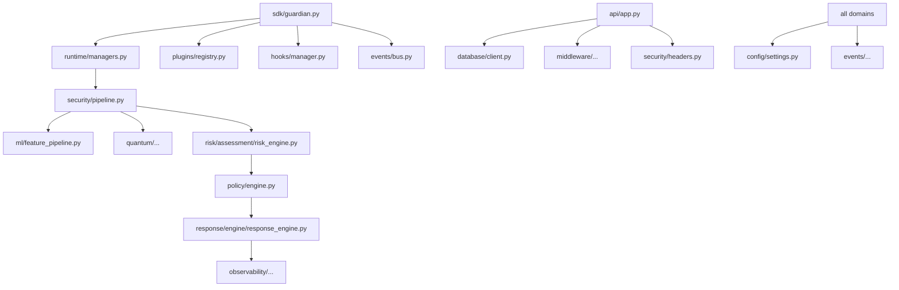

# 02. Folder Documentation — Q-Gaudrail

> **Document index:** this is document 02 of the Q-Gaudrail technical documentation set.

This document describes each directory in the repository: its role, the files it contains, and how it relates to other parts of the system. Per-file descriptions for source files live in `03_Source_File_Documentation.md`; the tree in `01_Project_Structure.md` is the canonical layout.

## 1. Repository Root (`/`)

Root-level files are project configuration and community files:

| Entry | Purpose |
|---|---|
| `pyproject.toml` | Build system, package metadata, dependencies, dev tooling config |
| `requirements.txt` | Pinned requirements (with a commented orjson pin quirk on line 28) |
| `Makefile` | Task runner for install/test/lint/format/run targets |
| `docker-compose.yml` | Local MongoDB + service composition |
| `docker/Dockerfile` | Container image definition |
| `.dockerignore` | Files excluded from the Docker build context |
| `.env.example` | Template for environment variables consumed by settings |
| `.gitignore` | Git ignore rules |
| `README.md`, `CHANGELOG.md`, `SECURITY.md`, `CONTRIBUTING.md`, `CODE_OF_CONDUCT.md`, `LICENSE`, `LICENSE_PENDING.md` | Project metadata and community docs |
| `.github/workflows/` | CI, release, and benchmark pipelines |

## 2. `.github/workflows/` — CI/CD

GitHub Actions pipeline definitions:

- `ci.yml` — continuous integration (install, test, lint) on pushes/PRs.
- `release.yml` — release automation (build, tag, publish).
- `benchmark.yml` — performance benchmark workflow.

See `04_Configuration_File_Documentation.md` and `11_Deployment_Guide.md`.

## 3. `src/q_guardian/` — the q_guardian package

The package contains all production code (314 Python files). Top-level subdirectories:

### 3.1 `adapters/` — Agent framework adapters
- **Purpose:** adapt a runtime security/reasoning surface onto external agent frameworks.
- **Files:** `base.py` (abstract adapter), `generic.py`, plus AutoGen, CrewAI, Google ADK, LangGraph, OpenAI Agents, Semantic Kernel adapters.
- **Used by:** the SDK (`sdk/guardian.py`) and runtime managers.

### 3.2 `api/` — HTTP service layer
- **Purpose:** FastAPI application factory, versioned router, endpoint modules.
- **Files:** `app.py` (application factory + lifespan), `v1/router.py`, `v1/endpoints/health.py`, `v1/endpoints/system.py`.
- **Exposes:** `GET /health`, `GET /system/version`, `GET /system/status`.

### 3.3 `config/` — Settings
- **Purpose:** centralized, environment-driven configuration.
- **Files:** `settings.py` (pydantic-settings composite settings object returned by `get_settings()`).

### 3.4 `core/` — Framework core
- **Purpose:** shared constants and framework lifecycle state.
- **Files:** `constants.py`, `framework_state.py`.

### 3.5 `database/` — Persistence
- **Purpose:** MongoDB connectivity and health checks.
- **Files:** `client.py` (motor/pymongo client + connect/disconnect), `health.py`.

### 3.6 `dependencies/` — DI container
- **Purpose:** dependency injection wiring for the service.
- **Files:** `container.py`.

### 3.7 `events/` — Event system
- **Purpose:** synchronous event bus and standard domain events.
- **Files:** `base.py`, `bus.py`, `standard.py`.
- **Used by:** `sdk/guardian.py` (publishes `framework.started`/`framework.stopped`), and every module that emits events.

### 3.8 `exceptions/` — Exception hierarchy
- **Purpose:** project-wide exception classes and exception handlers.
- **Files:** `base.py`, `handlers.py`.

### 3.9 `framework/` — Framework config & context
- **Purpose:** framework-level configuration object and execution context.
- **Files:** `config.py`, `context.py`.

### 3.10 `hooks/` — Hook manager
- **Purpose:** lifecycle/interception hooks for plugins and SDK.
- **Files:** `manager.py`.

### 3.11 `logging/` — Structured logging
- **Purpose:** structlog configuration and ASGI logging middleware.
- **Files:** `config.py`, `middleware.py`.

### 3.12 `middleware/` — ASGI middleware
- **Purpose:** correlation ID propagation, exception logging, response timing.
- **Files:** `correlation.py`, `exception.py`, `timing.py`.
- **Note:** security-related middleware (headers, trusted host, CORS) lives in `security/`.

### 3.13 `ml/` — Classical machine learning
- **Purpose:** model base classes, feature pipeline, datasets (CSV/JSON/Hugging Face), anomaly/classifier/ensemble models, model manager, training, inference, evaluation metrics, storage, events, plugin.
- **Files:** see tree in `01_Project_Structure.md`; detailed in `12_Quantum_ML_Documentation.md`.

### 3.14 `models/` — Base models
- **Purpose:** shared Pydantic model base classes.
- **Files:** `base.py`.

### 3.15 `observability/` — Observability subsystem
- **Purpose:** metrics engine + registry + collectors + aggregators + exporters; tracing (spans, context, correlation, exporters); health (engine, registry, checks, diagnostics, heartbeat); analytics (engine, statistics, trend analysis, forecasting, reports); alerts (engine, rules, routing, escalation, notifier); dashboard (API, DTO, endpoints, filters, serializers); integrations (Prometheus, Grafana, Datadog, CloudWatch, Azure Monitor); plus plugin, storage, data, enums, events, exceptions, config.
- **Detailed in:** `17_Observability_Operations_Documentation.md`.

### 3.16 `plugins/` — Plugin system
- **Purpose:** plugin base class and registry for extendable detection/response.
- **Files:** `base.py`, `registry.py`.

### 3.17 `policy/` — Policy engine
- **Purpose:** advanced policy enforcement: core evaluators (condition parser, conflict detector, evaluator, registry, simulation, version manager), DSL adapters, RBAC, composition, storage, config/data/enums/events/exceptions.
- **Detailed in:** `15_Policy_Risk_Documentation.md`.

### 3.18 `quantum/` — Quantum machine learning
- **Purpose:** Qiskit/PennyLane integration: backends (base/manager/qiskit/simulator), feature maps (angle, Pauli, ZZ), kernels, QSVM model + manager, fusion engine + strategies (adaptive, bayesian, confidence, stacking, weighted voting), execution, inference, evaluation, training (trainer, kernel trainer), config/data/enums/events/exceptions/plugin/storage.
- **Detailed in:** `12_Quantum_ML_Documentation.md`.

### 3.19 `repositories/` — Repository abstraction
- **Purpose:** base repository pattern for data access.
- **Files:** `base.py`.

### 3.20 `response/` — Response & recovery
- **Purpose:** response orchestration: engine (response, orchestration, recovery, rollback, approval), evidence (collector, snapshot, timeline), playbooks (executor, parser, registry, templates, validator), quarantine (manager, session, memory, agent, plugin), notifications (notifier, email, slack, teams, webhook), integrations (Splunk, QRadar, Sentinel, Cortex, ServiceNow), plus config/data/enums/events/exceptions/plugin/storage.
- **Detailed in:** `16_Response_Recovery_Documentation.md`.

### 3.21 `risk/` — Risk assessment
- **Purpose:** risk engine (assessment/risk_engine), severity/confidence/threat/trust engines, explainability (explanation engine, reasoning graph, report generator), actions (action engine, audit, notifier, responders), policy (evaluator, policies, policy engine, policy registry), plus config/data/enums/events/exceptions/plugin/storage.
- **Detailed in:** `15_Policy_Risk_Documentation.md`.

### 3.22 `runtime/` — Runtime models & context
- **Purpose:** runtime models (entities), context, enums, events, managers (the largest file in the package at 538 lines).
- **Files:** `models.py`, `context.py`, `enums.py`, `events.py`, `managers.py`.

### 3.23 `schemas/` — API schemas
- **Purpose:** request/response schemas.
- **Files:** `base.py`.

### 3.24 `sdk/` — Public SDK
- **Purpose:** `Guardian` facade that composes runtime managers, plugins, hooks and event bus; lifecycle methods `start()`/`shutdown()`.
- **Files:** `guardian.py` (517 lines).

### 3.25 `security/` — Security pipeline
- **Purpose:** the runtime security pipeline (normalize → features → rules → classic ML → QML → hybrid fusion), `SecurityDecisionEngine`, decision cascade, auth, headers, CORS, config, enums, events, extensibility, models, plugin.
- **Detailed in:** `10_Security_Overview.md`.

### 3.26 `services/` — Service base
- **Purpose:** base service abstraction.
- **Files:** `base.py`.

### 3.27 `utils/` — Utilities
- **Purpose:** datetime, env, helpers, json, uuid utilities.
- **Files:** `datetime_utils.py`, `env_utils.py`, `helpers.py`, `json_utils.py`, `uuid_utils.py`.

### 3.28 `benchmark/` — Third-party benchmark platform (V2.0 M1a)
- **Purpose:** run the real hybrid detection pipeline over curated third-party datasets: registry → download → validation → preprocessing → K-fold benchmark → report. Reuses `q_guardian.evaluation` (no new runtime deps, no changes to existing modules).
- **Files:** `registry.py` (`DatasetSpec` + `DatasetRegistry`, 3 public + 8 gated specs), `download.py` (`DatasetDownloader`, HF datasets-server rows API + local jsonl/csv/json, gated-without-token error), `validate.py` (`DatasetValidator`), `preprocessing.py` (`extract_text`/`resolve_label`/`extract_category`, `DatasetPreprocessor`), `run.py` (`BenchmarkRunner.run`/`run_all`), `report.py` (`BenchmarkReport`), `metrics.py` (`BenchmarkMetrics`).
- **Datasets:** `deepset/prompt-injections` (662 rows, Apache-2.0), `JailbreakBench/JBB-Behaviors` (200 rows, public), `databricks/databricks-dolly-15k` (benign corpus, cap 2000, CC BY-SA 3.0); 8 gated mission datasets registered with `requires_token=True` for M1b.
- **Detailed in:** `19_Benchmark_Platform_Documentation.md`.

### 3.29 `embeddings/` — Semantic embedding subsystem (V2.0 M3)
- **Purpose:** extend the handcrafted 43-feature pipeline with semantic embeddings through a modular provider interface — without modifying it. Three feature modes (`handcrafted` / `embedding` / `hybrid`) are selectable; a manager adds caching (LRU + JSON disk cache), batching, lazy loading and automatic fallback; explainability metadata/traces and dependency-injected trainer adapters make the pipeline observable and trainable.
- **Files:** `base.py` (`EmbeddingProvider` ABC: load/unload/embed/embed_batch/dimension/health/metadata + rolling latency), `errors.py` (exception hierarchy), `providers/hasher.py` (`HashEmbeddingProvider` + `hash_vector`, dependency-free offline default), `providers/sentence_transformers.py` (`MiniLM`/`BGE`/`E5` via lazy import + injectable `model_factory`), `providers/cloud.py` (`OpenAI`/`Azure`/`Voyage`/`Cohere` placeholders, `implemented=False`), `manager.py` (`EmbeddingManager`, `EmbeddingCache`, `build_manager`), `explain.py` (`EmbeddingMeta`, `EmbeddingTrace`), `fusion.py` (`FeatureMode`, `ModeFeatureExtractor`, `EmbeddingFeatureProvider`, `ModeHybridEvaluator`), `integration.py` (`ModeTrainingAdapter`, `ModeQuantumAdapter`), `benchmark.py` (`ModeDetectionBenchmark`, `ModeComparisonReport`, `ModeComparisonRunner`).
- **Detailed in:** `20_Embedding_Pipeline.md`.

### 3.30 `evaluation/` — Detection evaluation harness
- **Purpose:** `BenchmarkSample`/`PromptBenchmarkDataset`, pure-Python detection metrics (ROC/PR AUC, ECE, Brier, confusion-matrix metrics), `HybridEvaluator`, `DetectionBenchmark.run` (K-fold CV + provider ablation), JSON/Markdown report rendering.
- **Files:** `dataset.py`, `metrics.py`, `pipeline.py`, `benchmark.py`, `report.py`, `__init__.py`.

## 4. `tests/` — Test suite

| Subdirectory | Files | Focus |
|---|---|---|
| `tests/unit/` | 88 test files | Component-level tests (config, events, hooks, plugins, ml, policy, quantum, risk, runtime, sdk, security, utils, fusion, benchmark, embeddings) |
| `tests/observability/` | 24 test files | Metrics, tracing, health, analytics, alerts, dashboard, exporters, integrations |
| `tests/response/` | 9 test files | Engines, evidence, playbooks, quarantine, notifications, integrations, plugin/storage |
| `tests/integration/` | 2 test files | API endpoints, Guardian lifecycle + plugin hooks |
| `tests/fixtures/` | conftest.py | Shared fixtures (duplicate of root conftest semantics) |
| `tests/conftest.py` | root | Global fixtures; Windows event-loop policy; env fixture |

Totals: **123 `test_*.py` files + `conftest.py`/`__init__.py`; 2,650 test functions** (current CI run).

## 5. `scripts/` — Tooling

| Subdirectory | Files | Focus |
|---|---|---|
| `scripts/benchmarks/` | benchmark runner + benchmarks + `run_benchmarks.py` | Benchmarking suite (runnable via `python -m scripts.benchmarks`) |
| `scripts/loadtest/` | load tester, reporter, scenarios, `run_loadtest.py`, `results/*.json` | Load testing with persisted JSON reports |
| `scripts/packaging/` | build + validate | Package build/validation tooling |
| `scripts/profile/` | memory profiler, optimization report, runner | Profiling and optimization reporting |
| `scripts/prompt_cli.py` | — | Interactive REPL / single-shot CLI with `:label`/`:learn` commands and JSONL memory |
| `scripts/train_data.py` | — | Training data generation helper |
| `scripts/evaluate_pipeline.py` | — | Detection-quality benchmark CLI (K-fold CV + provider ablation over the real hybrid pipeline) |

## 6. `examples/` — Runnable examples

- `prompt_test_harness.py` — 8-stage pipeline demo (normalize → feature extraction → rules → classical ML → quantum QSVM on 5 features → hybrid fusion → risk assess → policy `strict-security` → response).
- Framework examples: `crewai/`, `google_adk/`, `hybrid_multiagent/`, `langgraph/`, `openai_agents/`, `semantic_kernel/`.
- Generated artifacts (not source): `qg_memory.jsonl` (CLI memory), `qg_state/` (`anomaly.pkl`, `rf.pkl`, `scaler.pkl`, `qsvm.json`, `corpus.json`).

## 7. `docs/` — Documentation

Contains the 17 pre-existing user guides (e.g. `architecture-guide.md`, `user-guide.md`, `ml-security.md`) plus this generated set `00_Project_Overview.md` … `18_Tests_Scripts_Examples_Documentation.md` and the root `README.md`.

## 8. `docker/`, `logs/`, `models/ml/`

- `docker/` — container build context (one `Dockerfile`).
- `logs/` — runtime log destination (`q_guardian.log`, effectively empty).
- `models/ml/` — reserved for ML artifacts (present but empty; referenced by `.gitignore` and tooling).

## 9. Directory Interaction Summary

