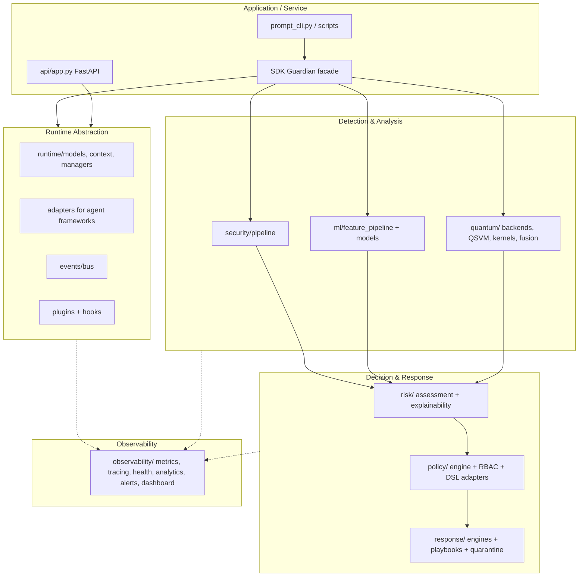
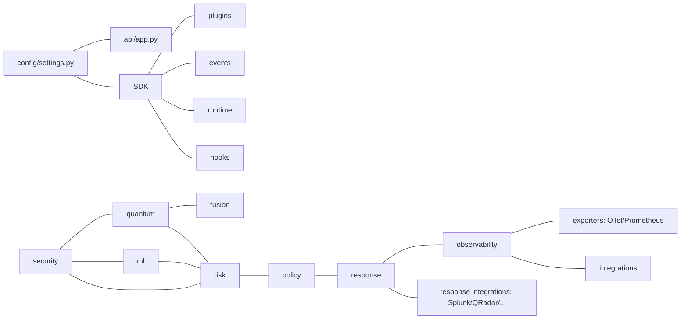

# 06. Architecture Documentation — Q-Gaudrail

> **Document index:** this is document 06 of the Q-Gaudrail technical documentation set.

## 1. Architectural Principles

Derived from code structure, docstrings, and the pre-existing `docs/architecture-guide.md`:

1. **Clean architecture** — separation of domains (runtime, security, ml, quantum, risk, policy, response, observability) with domain models and engines.
2. **Plugin-first** — extension via `Plugin` lifecycle (initialize/start/stop) and `PluginRegistry`; SDK facade `Guardian` is the composition root.
3. **Event-driven** — a synchronous `EventBus` (with wildcard subscriptions) is the primary communication mechanism; framework, runtime, security, ml, quantum, risk, policy, response, and observability each define their own event models.
4. **Async-first** — `async def` across the SDK, plugins, engines, and API; `pytest-asyncio` explicit markers.
5. **Type-safe** — strict mypy (`strict = true`), pydantic models everywhere, `from __future__ import annotations`.
6. **Zero-trust / layered defense** — no single detector decides; the pipeline normalizes → extracts → rules → classical ML → QML → hybrid fusion → risk → policy → response.

## 2. Layered Overview



## 3. Runtime Flow (end-to-end decision pipeline)

The canonical flow exercised by `examples/prompt_test_harness.py`:

1. **Normalize** the raw prompt (`security/pipeline.py` `PromptNormalizer`).
2. **Feature extraction** (`PromptFeatureExtractor`): code blocks, URLs, markdown, keywords, HTML, unicode, entropy, ratios, special chars.
3. **Rules** (`RuleEngine`): default + custom keyword/pattern rules → `PromptFinding`s.
4. **Classical ML** (`ml/`): feature pipeline → trained detectors (anomaly, random forest, xgboost).
5. **Quantum ML** (`quantum/`): feature encoding → quantum kernel/QSVM on 5 features.
6. **Hybrid fusion** (`quantum/fusion/`): strategies (weighted voting, confidence, adaptive, bayesian, stacking) combine classical + quantum predictions.
7. **Risk assessment** (`risk/assessment/risk_engine.py` `RiskAssessmentEngine.assess`): threat/severity/confidence/trust sub-scores → `RiskAssessment` (score, level, severity, decision, action, reasoning, graph, explanation, notifications).
8. **Policy enforcement** (`policy/engine.py` `AdvancedPolicyEngine`): apply policy (e.g. `strict-security`), RBAC, simulation, conflict detection → decision.
9. **Response** (`response/`): `ResponseEngine`/`OrchestrationEngine` execute allow/warn/review/block actions, quarantine, evidence, notifications, rollback, recovery, approvals.

## 4. Component Detail

### 4.1 Application entry (`api/app.py`)
`create_app()` builds the FastAPI app with:
- **Metadata:** title `Q-Guardian`, description, version `1.0.0`, `/docs`, `/redoc`, `/openapi.json`.
- **Lifespan:** `setup_logging` → log `application_starting` → `get_db_client().connect()` (MongoDB; failure only warns) → on shutdown `db_client.disconnect()`.
- **Middleware** (registered in this order; FastAPI executes in reverse registration order, so the last registered wraps the outermost):
  1. `TrustedHostMiddleware` — only when **not** production (`allowed_hosts=["*"]` in dev).
  2. CORS via `security/cors.py`.
  3. `SecurityHeadersMiddleware`.
  4. `ExceptionLoggingMiddleware`.
  5. `ResponseTimingMiddleware`.
  6. `CorrelationIDMiddleware` (outermost).
- **Routes:** `GET /` (root info), and `api_v1_router` under `/api/v1`.

### 4.2 v1 Router (`api/v1/router.py`)
Aggregates endpoint routers:
- `/api/v1/health` (tags `Health`)
- `/api/v1/system` (tags `System`)
Future routers (prompt injection, jailbreak, threats) are scaffolded as comments only.

### 4.3 SDK facade (`sdk/guardian.py` — `Guardian`)
Composition root that owns:
- `FrameworkStateMachine` (state machine),
- `EventBus`,
- `PluginRegistry`,
- `HookManager`,
- adapters dict,
- runtime managers: `SessionManager`, `RequestManager`, `ToolExecutionTracker`, `MemoryTracker`,
- current `Agent`, `AgentSession`, `RuntimeContext`.

Lifecycle:
- `start()`: INITIALIZING → create `FrameworkContext` → STARTING → discover plugins (if enabled) → `initialize_all` → `start_all` → RUNNING → update runtime context → publish `FrameworkStarted`.
- `shutdown()`: if RUNNING/ERROR → STOPPING → publish `FrameworkStopped` → `stop_all` → clear bus/hooks → STOPPED.

Convenience dispatch (plugin interfaces):
- `scan_prompt()` → `before_prompt` hook → `BeforePrompt` event → plugins with `prompt_scanner` interface → `after_prompt` hook → `AfterPrompt` event.
- `monitor()`, `calculate_risk()`, `enforce_policy()` → plugins implementing `runtime_monitor`, `risk_engine`, `policy_engine` interfaces.

Runtime helpers: `set_agent()`, `create_session()` (publishes `SessionStarted`), `close_session()` (publishes `SessionEnded`).

### 4.4 Runtime abstraction (`runtime/`)
- `models.py`: `Agent`, `AgentSession`, `AgentRequest`, `TokenUsage`, `AgentResponse`, `ToolInvocation`, `MemoryAccess`, `SecurityContext`, `ThreatContext`, `RiskContext`.
- `context.py`: `RuntimeContext` (current agent/session/framework context).
- `managers.py`: `SessionManager`, `RequestManager`, `ToolExecutionTracker`, `MemoryTracker`.
- **No detection logic** — pure reusable abstractions per `docs/runtime-architecture.md`.

### 4.5 Event system (`events/`)
- `Event` base (id, timestamp, source, data), `EventHandler` type, `EventBus` with subscribe/publish/unsubscribe/clear, wildcard (`"*"`) subscriptions, priority ordering, handler error isolation, dedup flags, `publish_sync`.
- `standard.py`: framework events (`FrameworkStarted`, `FrameworkStopped`, `BeforePrompt`, `AfterPrompt`, …).

### 4.6 Plugin & hook system (`plugins/`, `hooks/`)
- `Plugin` base: name/version metadata, `initialize(context)`, `start()`, `stop()`, `health_check()`, optional interface methods.
- `PluginRegistry`: register/get/unregister/list, enable/disable, `initialize_all`/`start_all`/`stop_all`, `get_plugins_by_interface`, static `discover_plugins()` (entry points).
- `HookManager`: named hook points with ordered, async handler execution and error isolation.

### 4.7 Detection & analysis layer
- **Security pipeline** (`security/pipeline.py`, 478 lines): normalizer → validator → feature extractor → rule engine; feeds `ml/`, `quantum/`, fusion.
- **ML** (`ml/`): `feature_pipeline`, model base, anomaly/classifier/ensemble models, `ModelManager`, `trainer`, `InferenceEngine`, dataset loaders, evaluation metrics, storage, `ThreatAnalysisPlugin`.
- **Quantum** (`quantum/`): backends (Qiskit adapter + `LocalSimulatorBackend`), feature maps (angle/Pauli/ZZ), `QuantumKernelEstimator`, `QSVMModel`, `QuantumInferenceEngine`, fusion engine + 5 strategies, `KernelTrainer`, model manager, storage.

### 4.8 Decision & response layer
- **Risk** (`risk/`): `ThreatScorer`, `TrustEngine`, `ConfidenceEngine`, `SeverityEngine`, `RiskAssessmentEngine`, explainability (reasoning graph, report generator), actions, risk policies.
- **Policy** (`policy/`): `AdvancedPolicyEngine`, core evaluators (`ConditionParser`, `PolicyEvaluator`, `Registry`, `SimulationEngine`, `ConflictDetector`, `VersionManager`), DSL adapters (Rego/Cedar/YAML/JSON), RBAC, composition, storage.
- **Response** (`response/`): `ResponseEngine`, `OrchestrationEngine`, `RecoveryEngine`, `RollbackEngine`, `ApprovalEngine`, evidence subsystem, playbooks, quarantine, notifications, integrations (Splunk/QRadar/Sentinel/Cortex/ServiceNow).

### 4.9 Observability (`observability/`)
- Metrics (registry/collectors/aggregators/exporters/engine), tracing (spans/context/correlation/exporters/engine), health (registry/checks/diagnostics/heartbeat/engine), analytics (statistics/trend/forecast/reports/engine), alerts (rules/routing/escalation/notifier/engine), dashboard (API/DTO/endpoints/filters/serializers), integrations (Prometheus/Grafana/Datadog/CloudWatch/Azure Monitor), storage, plugin.

## 5. Middleware Execution Order (HTTP)

For an incoming request, middleware executes outer-first:

```
CorrelationID → ResponseTiming → ExceptionLogging → SecurityHeaders → CORS → TrustedHost(dev) → route
```

## 6. Dependencies Between Layers



## 7. Design Notes & Limitations

- The HTTP API currently exposes only health/system endpoints; the full capability is exercised through the SDK and plugins. The router explicitly scaffolds future endpoint modules.
- MongoDB connection failure at startup is logged as a warning, not fatal (`api/app.py:66-68`); `/health` reports `degraded` when the database is unhealthy.
- The `Guardian` event bus is synchronous (async API but in-process dispatch), not a distributed message bus.
- Quantum execution defaults to the local simulator; real-device execution depends on backend availability.

## 8. Related Documents

- `00_Project_Overview.md` — high-level summary.
- `07_API_Reference_Documentation.md` — HTTP + SDK API details.
- `10_Security_Overview.md` — the security pipeline and decision engine.
- `12_Quantum_ML_Documentation.md` — ML + quantum internals.
- `13_Plugin_System_Events_Hooks_SDK_Documentation.md` — plugins, events, hooks, SDK.
- `14_Framework_Core_Infrastructure_Documentation.md` — framework core & infrastructure.
- `15_Policy_Risk_Documentation.md` — risk + policy engines.
- `16_Response_Recovery_Documentation.md` — response subsystem.
- `17_Observability_Operations_Documentation.md` — observability subsystem.
- Pre-existing: `docs/framework-architecture.md`, `docs/runtime-architecture.md`, `docs/architecture-guide.md`.
