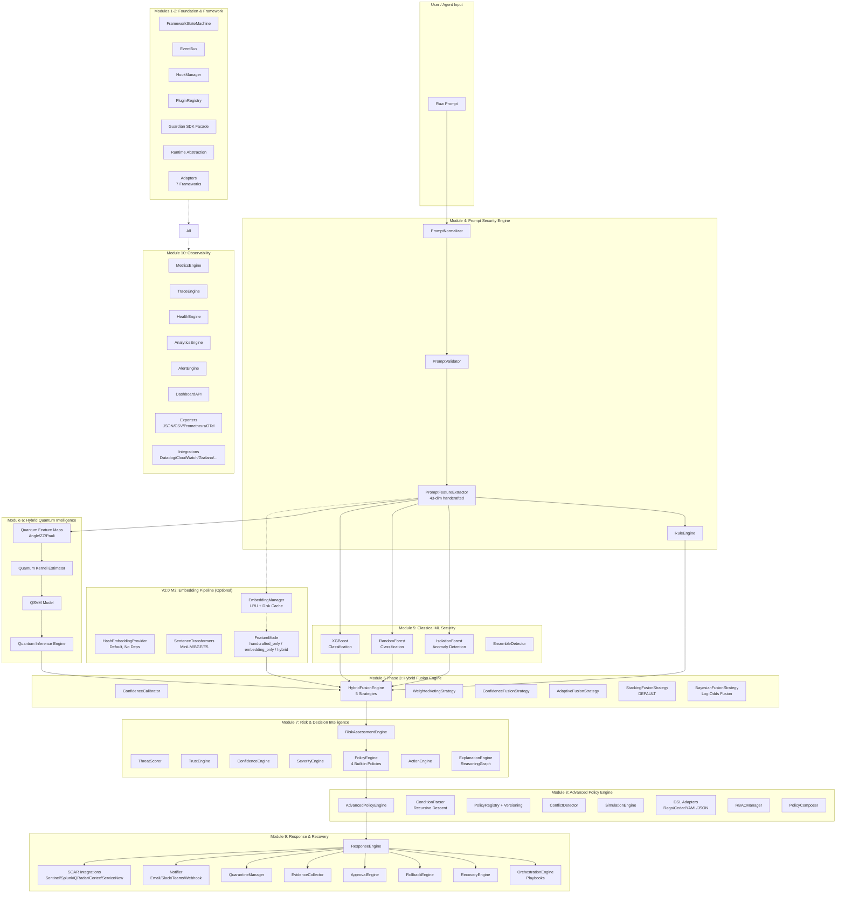

# Architecture Quick Reference — Q-Guardian

> One-page reference for AI agents to understand the project without reading source code.

---

## Full Pipeline (Mermaid)



---

## Module Dependency Graph

```
Foundation (no deps)
├── utils/*, exceptions/base.py, core/constants.py
├── framework/config.py, adapters/base.py
├── repositories/base.py, services/base.py
├── models/base.py, schemas/base.py

Singleton Providers
├── config/settings.get_settings()
├── database/client.get_db_client()
├── dependencies/container.get_container()

Hubs
├── events/base → bus → standard
├── plugins/base → registry
├── hooks/manager
├── framework/context

Assembler: sdk/guardian.py
├── Consumes: adapters, framework, events, hooks, plugins, runtime

API Wiring: api/app.py
├── Consumes: config, logging, middleware, exceptions, database, v1 endpoints

Detection Pipeline (linear)
├── security/pipeline.py → ml/ → quantum/ → quantum/fusion/

Decision Layer
├── risk/ → policy/ → response/

Observability (subscribes to all)
├── observability/* ← event bus "*"
```

---

## Key Entry Points

| Entry Point | File | Purpose |
|-------------|------|---------|
| **HTTP Service** | `src/q_guardian/main.py` → `api/app.py:create_app()` | FastAPI app, lifespan, middleware, routes |
| **Python SDK** | `src/q_guardian/sdk/guardian.py:Guardian` | Single facade: `start()`, `scan_prompt()`, `shutdown()` |
| **CLI** | `src/q_guardian/cli.py:main` | `q-guardian dataset/model/benchmark` commands |
| **Plugin Discovery** | `src/q_guardian/plugins/registry.py:discover_plugins()` | Entry-point based (`q_guardian.plugins` group) |

---

## Plugin Interfaces (for `Guardian.scan_prompt` dispatch)

| Interface | Method | Built-in Plugins |
|-----------|--------|------------------|
| `prompt_scanner` | `scan_prompt(prompt, **kwargs)` | `PromptScannerPlugin`, `ThreatAnalysisPlugin` |
| `quantum_analyzer` | `register_model()`, `get_model()` | `QuantumAnalysisPlugin` |
| `risk_engine` | `calculate_risk(data)` | `RiskAnalysisPlugin` |
| `policy_engine` | `enforce_policy(data)` | (risk policy plugin) |
| `runtime_monitor` | `monitor(data)` | `ObservabilityPlugin` |

---

## Event Types (Standard + Domain)

| Category | Event Types |
|----------|-------------|
| Framework | `framework.started`, `framework.stopped`, `plugin.loaded`, `plugin.unloaded` |
| Prompt | `prompt.received`, `prompt.before`, `prompt.after` |
| Threat | `threat.detected` |
| Risk | `risk.score.calculated`, `risk.threat.scored`, `risk.trust.updated`, `risk.policy.matched`, `risk.policy.executed`, `risk.action.executed`, `risk.explanation.generated`, `risk.assessment.completed` |
| Policy | `PolicyRegistered`, `PolicyUpdated`, `PolicyEvaluated`, `PolicyConflictDetected`, `PolicySimulated`, `PolicyActivated`, `PolicyDeactivated` |
| Response | `ResponseInitiated`, `ResponseCompleted`, `PlaybookStarted`, `QuarantineActivated`, `ApprovalRequested`, `RollbackInitiated`, `RecoveryInitiated` |
| Observability | `observability.metric.recorded`, `observability.health.changed`, `observability.trace.started`, `observability.alert.raised`, `observability.dashboard.updated` |

---

## Configuration Hierarchy

```
Environment Variables (pydantic-settings)
    ↓
AppSettings (APP_*), DatabaseSettings (MONGODB_*), SecuritySettings, CORSSettings, LoggingSettings
    ↓
FrameworkConfig (aggregates 6 sub-configs)
    ├─ PluginConfig (enabled, priority)
    ├─ RuntimeConfig (max_concurrent_agents, request_timeout, enable_caching)
    ├─ PolicyConfig (enforcement_mode, default_policy)
    ├─ QuantumConfig (enabled, backend)
    ├─ DashboardConfig (enabled, refresh_interval)
    └─ PromptScannerConfig (enabled, sensitivity)
    ↓
Module-Specific Configs (all Pydantic BaseModel, extra="allow")
    ├─ MLConfig (ml/config.py)
    ├─ QuantumConfig (quantum/config.py - distinct from FrameworkConfig.QuantumConfig)
    ├─ ResponseEngineConfig (response/config.py)
    ├─ ObservabilityConfig (observability/config.py)
    ├─ TrainingPipelineConfig (training/config.py)
    └─ Benchmark config (via DatasetSpec in benchmark/registry.py)
```

---

## Data Flow: `Guardian.scan_prompt("malicious prompt")`

```
1. Guardian.scan_prompt()
   ├─ before_prompt hook (context merge)
   ├─ BeforePrompt event (bus publish)
   ├─ For each plugin with prompt_scanner interface:
   │   ├─ PromptScannerPlugin → SecurityDecisionEngine.decide()
   │   │   ├─ PromptNormalizer.normalize()
   │   │   ├─ PromptValidator.validate()
   │   │   ├─ PromptFeatureExtractor.extract() → 43-dim vector
   │   │   ├─ RuleEngine.analyze() → PromptFinding[]
   │   │   └─ SecurityDecisionEngine.decide() → PromptDecision
   │   └─ ThreatAnalysisPlugin (if ML enabled)
   │       ├─ Same pipeline + MLFeatureProvider (43-dim)
   │       ├─ InferenceEngine.run() → IsolationForest, RF, XGBoost
   │       ├─ QuantumAnalysisPlugin (if quantum enabled)
   │       │   ├─ EmbeddingManager (optional, V2.0 M3)
   │       │   ├─ QuantumInferenceEngine → QSVM
   │       │   └─ HybridFusionEngine → FusedPrediction
   │       └─ SecurityDecisionEngine.decide() → PromptDecision
   ├─ after_prompt hook
   └─ AfterPrompt event
```

---

## Feature Vectors (Critical Distinction)

| Vector | Dimensions | Used By |
|--------|------------|---------|
| **MLFeatureProvider** | 43 | Training pipeline, future models |
| **Built-in Models** | 12 | IsolationForest, RandomForest, XGBoost, QSVM |
| **Embedding (V2.0 M3)** | 16 | `HashEmbeddingProvider` / `SentenceTransformers` |
| **Hybrid Mode** | 59 | `FeatureMode.hybrid` = 43 + 16 |

---

## Fusion Strategies (Default: Stacking)

| Strategy | Name | Weight Source | Notes |
|----------|------|---------------|-------|
| Weighted Voting | `weighted_voting` | Config / provider weights | Simple vote |
| Confidence Fusion | `confidence_fusion` | Provider's own confidence | Self-weighted |
| Adaptive | `adaptive` | Rolling accuracy (window=100) | Learns per-provider |
| **Stacking** | `stacking` | **Logistic Regression meta-learner** | **DEFAULT**, needs training |
| Bayesian | `bayesian` | — | Interface only, raises `FusionError` |

---

## Built-in Policies (Risk Module)

| Policy | Default Action | Critical/Severe | High | Moderate | Low |
|--------|----------------|-----------------|------|----------|-----|
| `default-security` | ALLOW | BLOCK | ESCALATE | REVIEW | WARN |
| `strict-security` | WARN | BLOCK | BLOCK | REVIEW | WARN |
| `permissive-security` | ALLOW | BLOCK | LOG | LOG | LOG |
| `quarantine-security` | ALLOW | QUARANTINE | REVIEW | — | — |

---

## Response Actions (Priority Order)

```
action_plan.actions[0] > policy_decision.action > risk_assessment > ALLOW
```

| Policy Action | ResponseAction | Responder |
|---------------|----------------|-----------|
| allow | ALLOW | ContinueResponder |
| warn | WARN | AlertResponder |
| log/review | LOG_ONLY | AuditLogResponder |
| block/quarantine/terminate | BLOCK | BlockResponder |
| escalate | ESCALATE | NotifyAdminResponder |
| custom | CUSTOM | WebhookResponder |

---

## Built-in Playbooks

| Name | Triggers | Steps |
|------|----------|-------|
| `block-threat` | threat_detected, prompt_injection, jailbreak | evidence → quarantine → block → notify → report |
| `quarantine-agent` | suspicious_behavior, anomaly_detected | evidence → quarantine-agent → **approval** → notify |
| `escalate-incident` | high_severity, critical_risk | evidence → escalate → notify-ops (pagerduty) → ticket |
| `rollback-operation` | deployment_failed, policy_error | capture → rollback → verify → notify |

---

## Observability Stack

| Engine | Key Features |
|--------|--------------|
| MetricsEngine | Counter/Gauge/Histogram/Timer, aggregation, percentiles, collectors |
| TraceEngine | W3C propagation, TTL store (10k traces, 1hr), span events |
| HealthEngine | Component checks, heartbeat (stale detection), diagnostics |
| AnalyticsEngine | Trends, forecasting (linear/MA/exp), provider accuracy, top-N |
| AlertEngine | Threshold rules, cooldown, escalation chains, notifiers |
| DashboardAPI | JSON facade over all engines, DTOs, filters, serializers |

**Exporters**: JSON, CSV, Prometheus (text exposition), OpenTelemetry (OTLP 1.21.0)
**Integrations**: Azure Monitor, CloudWatch, Datadog, Grafana, Prometheus (all stub → local store)

---

## Adapters Status (All Stubs)

| Adapter | Framework | Status |
|---------|-----------|--------|
| `GenericAdapter` | Generic | `NotImplementedError` |
| `AutoGenAdapter` | Microsoft AutoGen | `NotImplementedError` |
| `CrewAIAdapter` | CrewAI | `NotImplementedError` |
| `GoogleADKAdapter` | Google ADK | `NotImplementedError` |
| `LangGraphAdapter` | LangGraph | `NotImplementedError` |
| `OpenAIAgentsAdapter` | OpenAI Agents SDK | `NotImplementedError` |
| `SemanticKernelAdapter` | Semantic Kernel | `NotImplementedError` |

**Only `Adapter` base class is exported publicly.**

---

## V2.0 Additions (Post v1.1.0)

| Feature | Module | Status | Docs |
|---------|--------|--------|------|
| Benchmark Platform | `benchmark/` | ✅ M1a | `19_Benchmark_Platform_Documentation.md` |
| Embedding Pipeline | `embeddings/` | ✅ M3 | `20_Embedding_Pipeline.md` |
| Training Pipeline | `training/` + `cli.py` | ✅ M1c | `21_Training_Pipeline_Documentation.md` |

**Embedding Pipeline Modes:**
- `handcrafted_only` (43-dim) — original pipeline
- `embedding_only` (16-dim) — semantic only
- `hybrid` (59-dim) — combined

**Training Pipeline Stages:**
1. `dataset prepare` — download → normalize → dedup → split → leakage check
2. `model train` — fits `HybridEvaluator` (rule + IF + RF + XGB + optional QSVM)
3. `model evaluate` — test/validation/external pools, security matrix

---

## Key Numbers

| Metric | Value |
|--------|-------|
| Python Source Files | 354 |
| Test Files | 156 (2,755 tests passing) |
| Documentation Files | 49 |
| Modules | 10 core + 3 V2.0 |
| Plugin Interfaces | 5 |
| Standard Events | 15 |
| Fusion Strategies | 5 (5 implemented) |
| Built-in Policies | 4 |
| Built-in Playbooks | 4 |
| Response Actions | 15 |
| Adapter Frameworks | 7 (all stubs) |
| Quantum Backends | 4 (simulator, qiskit_aer, runtime, pennylane) |
| Embedding Providers | 4 (1 implemented, 3 placeholders) |

---

## File Locations for Deep Dives

| Topic | Document |
|-------|----------|
| Full Architecture | `docs/06_Architecture_Documentation.md` |
| Plugin/Event/Hook/SDK | `docs/13_Plugin_System_Events_Hooks_SDK_Documentation.md` |
| HTTP + SDK API | `docs/07_API_Reference_Documentation.md` |
| Quantum + ML | `docs/12_Quantum_ML_Documentation.md` |
| Policy + Risk | `docs/15_Policy_Risk_Documentation.md` |
| Response + Recovery | `docs/16_Response_Recovery_Documentation.md` |
| Observability | `docs/17_Observability_Operations_Documentation.md` |
| Embedding Pipeline | `docs/20_Embedding_Pipeline.md` |
| Training Pipeline | `docs/21_Training_Pipeline_Documentation.md` |
| Benchmark Platform | `docs/19_Benchmark_Platform_Documentation.md` |
| Source File Inventory | `docs/03_Source_File_Documentation.md` |
| Project Structure | `docs/01_Project_Structure.md` |