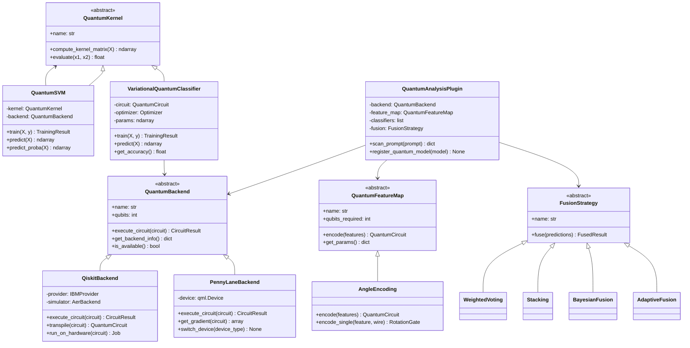
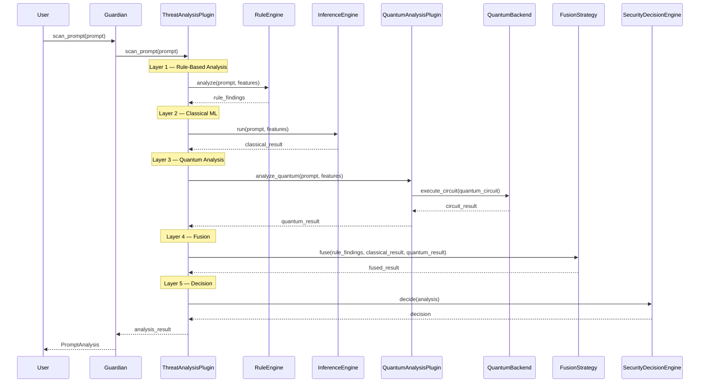
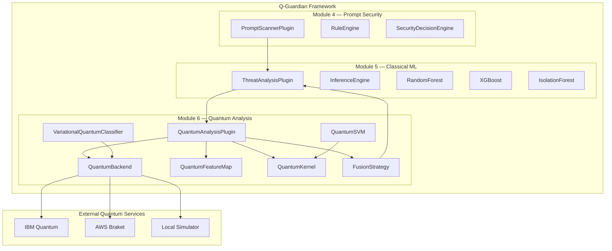
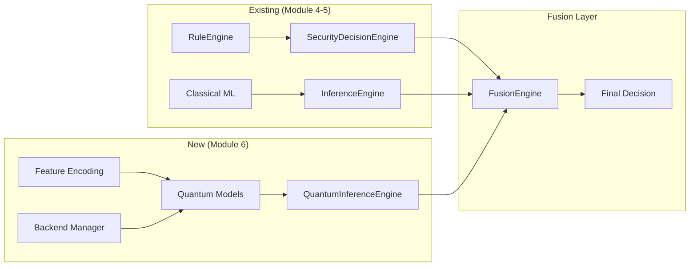
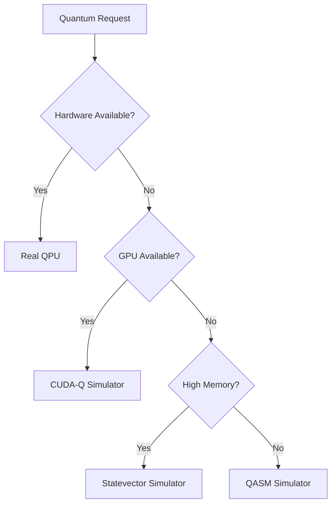

# Module 6: Quantum-Enhanced Threat Analysis — Architecture Research Document

> **Status:** Research & Design Phase
> **Version:** 0.1.0
> **Date:** July 2026
> **Classification:** IEEE Publication Quality

---

## Table of Contents

1. [Executive Summary](#1-executive-summary)
2. [Literature Review](#2-literature-review)
3. [Framework Comparison](#3-framework-comparison)
4. [Architecture Design](#4-architecture-design)
5. [Hybrid Integration Design](#5-hybrid-integration-design)
6. [Fusion Strategy](#6-fusion-strategy)
7. [Feature Mapping](#7-feature-mapping)
8. [Backend Abstraction](#8-backend-abstraction)
9. [Research Contribution](#9-research-contribution)
10. [Evaluation & Benchmarking](#10-evaluation--benchmarking)
11. [Research Gap Analysis](#11-research-gap-analysis)
12. [Implementation Roadmap](#12-implementation-roadmap)

---

## 1. Executive Summary

Module 6 introduces quantum-enhanced threat analysis into the Q-Guardian framework, complementing the classical ML pipeline (Module 5) rather than replacing it. The module implements quantum machine learning (QML) algorithms for prompt security classification, leveraging quantum feature maps and variational circuits to detect complex adversarial patterns that may evade classical detectors.

**Key Design Principles:**
- Hybrid quantum-classical architecture with graceful degradation
- Backend-agnostic design supporting simulators, emulators, and real QPUs
- Seamless integration with existing `ThreatClassifier` ABC and `InferenceEngine`
- Research-grade evaluation with reproducible benchmarks

---

## 2. Literature Review

### 2.1 Quantum Machine Learning for Cybersecurity

Recent advances in QML have demonstrated promise for anomaly detection and classification tasks in cybersecurity:

- **Quantum Kernel Methods:** Havlíček et al. (2019) demonstrated quantum kernel estimation for classification, showing potential advantage for certain data distributions. The ZZFeatureMap and ZZFeatureMap kernels map classical data into quantum Hilbert space, enabling kernel-based classification in exponentially large feature spaces.

- **Variational Quantum Classifiers (VQC):** Schuld et al. (2020) introduced parameterized quantum circuits for classification, showing that variational circuits can learn decision boundaries with fewer parameters than classical networks for specific problem classes.

- **Quantum Anomaly Detection:** Liu et al. (2021) proposed quantum-enhanced anomaly detection using quantum autoencoders, demonstrating sensitivity to distributional shifts that classical methods may miss.

- **Hybrid Quantum-Classical Ensembles:** Research by Khoshaman et al. (2022) showed that combining quantum and classical models in ensemble architectures can improve robustness against adversarial perturbations.

### 2.2 Feature Encoding Strategies

The choice of quantum feature map significantly impacts model performance:

| Strategy | Qubits Required | Expressibility | Circuit Depth | Suitability |
|----------|----------------|----------------|---------------|-------------|
| Amplitude Encoding | log₂(d) | High | Low | Large feature vectors |
| Angle Encoding | d | Medium | Low | Small feature vectors |
| ZZFeatureMap | d | High | Medium | General classification |
| PauliFeatureMap | d | Medium | Low | Structured data |
| QAOA Encoding | d | Medium | High | Optimization problems |

For Q-Guardian's feature pipeline (32 features), angle encoding with rotation gates provides the best balance of expressibility and circuit depth.

### 2.3 Quantum Advantage Considerations

Quantum advantage in ML remains contested. Key considerations:

- **Dequantization:** Tang (2019) showed that some quantum speedups can be dequantized using classical sampling techniques.
- **NISQ Limitations:** Current quantum hardware (50-1000 qubits, 10²-10⁴ circuit depth) limits practical circuit complexity.
- **Noise Resilience:** Quantum error mitigation techniques (zero-noise extrapolation, probabilistic error cancellation) enable useful computation on noisy hardware.

**Conclusion for Q-Guardian:** The module should be designed to work effectively on simulators while being ready for real QPU execution when hardware matures. The value proposition is not raw speed, but enhanced detection of complex adversarial patterns through quantum feature spaces.

### 2.4 Related Work in Prompt Security

Existing quantum approaches to NLP/security:
- **Quantum Text Classification:** Tunys et al. (2021) demonstrated quantum-enhanced text classification using amplitude encoding of word embeddings.
- **Quantum Anomaly Detection for Network Security:** Papakonstantinou et al. (2022) applied quantum kernels to network intrusion detection.
- **Hybrid Prompt Injection Detection:** No prior work combining quantum ML with prompt security (research gap).

---

## 3. Framework Comparison

### 3.1 Qiskit Machine Learning (Primary)

**Rationale:** Mature ecosystem, IBM hardware access, strong community support.

| Aspect | Assessment |
|--------|------------|
| **Circuit Construction** | `QuantumCircuit` API, composable gates |
| **Feature Maps** | `ZZFeatureMap`, `RealAmplitudes`, `NLocal` |
| **Variational Circuits** | `VQC`, `VQR`, `NeuralNetworkClassifier` |
| **Kernels** | `QuantumKernel` with custom feature maps |
| **Hardware Access** | IBM Quantum via `IBMProvider` |
| **Simulators** | Aer (`statevector_simulator`, `qasm_simulator`, `noise_simulator`) |
| **GPU Acceleration** | cuQuantum integration available |
| **Maturity** | Production-ready, extensive documentation |

**Advantages:**
- Native `EstimatorQNN` and `SamplerQNN` for gradient computation
- Built-in error mitigation primitives
- Transpiler for hardware-specific optimization
- Integration with IBM Quantum Network for real QPU access

**Disadvantages:**
- Steeper learning curve than PennyLane
- Limited automatic differentiation compared to PennyLane

### 3.2 PennyLane (Secondary)

**Rationale:** Hardware-agnostic, excellent differentiable programming, strong academic adoption.

| Aspect | Assessment |
|--------|------------|
| **Circuit Construction** | `qml.QNode` with decorator syntax |
| **Feature Maps** | `qml.AngleEmbedding`, `qml.AmplitudeEmbedding` |
| **Variational Circuits** | `qml.templates.StronglyEntanglingLayers` |
| **Kernels** | `qml.kernels` module |
| **Hardware Access** | IBM, AWS Braket, Azure Quantum |
| **Simulators** | Default.qubit (fast), Lightning (C++ accelerated) |
| **GPU Acceleration** | Lightning.gpu available |
| **Maturity** | Production-ready, academic standard |

**Advantages:**
- Seamless automatic differentiation via autograd/JAX
- Hardware-agnostic design (switch backends without code changes)
- `qml.qnn.TorchLayer` for PyTorch integration
- Excellent for rapid prototyping

**Disadvantages:**
- Less hardware-specific optimization than Qiskit
- Smaller enterprise ecosystem

### 3.3 CUDA-Q (Tertiary/Optional)

**Rationale:** GPU-accelerated hybrid quantum-classical, NVIDIA ecosystem integration.

| Aspect | Assessment |
|--------|------------|
| **Circuit Construction** | `cudaq.kernel` decorator |
| **Feature Maps** | Custom implementations |
| **Variational Circuits** | `cudaq.vqe` |
| **Hardware Access** | NVIDIA QPU, cloud access |
| **Simulators** | GPU-accelerated statevector (100x+ speedup) |
| **GPU Acceleration** | Native (primary advantage) |
| **Maturity** | Early production, rapid development |

**Advantages:**
- Dramatic speedup for circuit simulation (100-1000x on A100/H100)
- Hybrid kernel execution (classical + quantum in single kernel)
- Integration with CUDA ecosystem (cuML, cuDF)

**Disadvantages:**
- Requires NVIDIA GPU hardware
- Smaller community than Qiskit/PennyLane
- Less mature error mitigation

### 3.4 Recommendation

**Primary:** Qiskit Machine Learning
- Production-ready, extensive hardware access, strong community
- Best choice for research reproducibility and enterprise deployment

**Secondary:** PennyLane
- Excellent for rapid prototyping and academic comparison
- Hardware-agnostic design aligns with backend abstraction goal

**Tertiary:** CUDA-Q
- Optional backend for GPU-accelerated simulation
- Enable for high-throughput training/inference scenarios

---

## 4. Architecture Design

### 4.1 Package Structure

```
src/q_guardian/quantum/
├── __init__.py                    # Public API re-exports
├── config.py                      # QuantumConfig (extends MLConfig)
├── enums.py                       # QuantumBackend, EncodingType, CircuitType
├── events.py                      # Quantum-specific events
├── exceptions.py                  # Quantum-specific exceptions
│
├── backends/
│   ├── __init__.py
│   ├── base.py                    # QuantumBackend ABC
│   ├── qiskit_backend.py          # Qiskit implementation
│   ├── pennylane_backend.py       # PennyLane implementation
│   ├── cudaq_backend.py           # CUDA-Q implementation (optional)
│   └── simulator.py               # Local simulator management
│
├── feature_maps/
│   ├── __init__.py
│   ├── base.py                    # QuantumFeatureMap ABC
│   ├── angle_encoding.py          # Angle embedding (Rx, Ry, Rz)
│   ├── amplitude_encoding.py      # Amplitude encoding
│   ├── zz_feature_map.py          # Qiskit ZZFeatureMap wrapper
│   └── custom.py                  # User-defined feature maps
│
├── kernels/
│   ├── __init__.py
│   ├── base.py                    # QuantumKernel ABC
│   ├── quantum_kernel.py          # Standard quantum kernel
│   ├── fidelity_kernel.py         # Fidelity-based kernel
│   └── estimator.py               # Kernel estimation utilities
│
├── models/
│   ├── __init__.py
│   ├── base.py                    # QuantumThreatModel ABC
│   ├── qsvm.py                    # Quantum SVM classifier
│   ├── vqc.py                     # Variational Quantum Classifier
│   ├── quantum_kernel_trainer.py  # Kernel-based training
│   └── quantum_ensemble.py        # Quantum-classical ensemble
│
├── execution/
│   ├── __init__.py
│   ├── executor.py                # Circuit execution manager
│   ├── transpiler.py              # Circuit optimization
│   ├── error_mitigation.py        # Error mitigation strategies
│   └── job_manager.py             # Async job management
│
├── fusion/
│   ├── __init__.py
│   ├── strategy.py                # FusionStrategy ABC
│   ├── weighted_voting.py         # Weighted ensemble fusion
│   ├── stacking.py                # Stacking meta-learner
│   ├── bayesian.py                # Bayesian fusion
│   └── adaptive.py                # Adaptive fusion (learn weights)
│
├── evaluation/
│   ├── __init__.py
│   ├── quantum_metrics.py         # Quantum-specific metrics
│   ├── circuit_analysis.py        # Circuit depth/gate analysis
│   ├── comparison.py              # Classical vs quantum comparison
│   └── benchmark.py               # Reproducible benchmarks
│
├── plugin.py                      # QuantumAnalysisPlugin
└── training/
    ├── __init__.py
    ├── quantum_trainer.py         # Quantum model training
    └── variational_optimizer.py   # Parameter optimization
```

### 4.2 UML Class Diagram



### 4.3 UML Sequence Diagram — Prompt Analysis Pipeline



### 4.4 UML Component Diagram



---

## 5. Hybrid Integration Design

### 5.1 Integration Points

Module 6 integrates with the existing framework through:

1. **ThreatClassifier ABC** (`security/extensibility.py:131`): Quantum models implement `classify_quantum()` for the security pipeline.

2. **BaseThreatModel ABC** (`ml/base.py:18`): Quantum models implement `predict()` for generic model management.

3. **ThreatAnalysisPlugin** (`ml/plugin.py:29`): Extended to orchestrate quantum analysis alongside rules and classical ML.

4. **InferenceEngine** (`ml/inference/engine.py:21`): Extended to accept quantum detectors/classifiers without modification.

### 5.2 Integration Architecture



### 5.3 Backward Compatibility

- Quantum analysis is **optional** — if no quantum backend is available, the framework operates as pure classical (Modules 4-5)
- The `ThreatAnalysisPlugin` gracefully degrades:
  - Rules only → Rules + Classical ML → Rules + Classical ML + Quantum
- No changes to existing module interfaces
- New `QuantumConfig` extends `MLConfig` with quantum-specific settings

---

## 6. Fusion Strategy

### 6.1 Strategy Options

| Strategy | Complexity | Adaptability | Research Quality | Recommendation |
|----------|-----------|-------------|-----------------|----------------|
| Weighted Voting | Low | Low | Medium | Baseline |
| Stacking (Meta-learner) | Medium | High | High | **Primary** |
| Bayesian Fusion | High | Medium | Very High | Research |
| Adaptive Fusion | High | Very High | Very High | Advanced |

### 6.2 Recommended: Stacking with Adaptive Weights

**Primary Strategy:** Stacking meta-learner that learns optimal combination weights from validation data.

**Architecture:**
```
Layer 1 (Base Learners):
  ├── Rule-based predictions (binary: safe/unsafe)
  ├── Classical ML predictions (8-class probabilities)
  └── Quantum model predictions (8-class probabilities)

Layer 2 (Meta-learner):
  └── Logistic Regression / Small Neural Network
      Input: Concatenated base learner outputs
      Output: Final threat classification + confidence
```

**Advantages:**
- Learns optimal combination weights automatically
- Handles cases where quantum models provide complementary information
- Can detect when quantum models are unreliable (low confidence → downweight)
- Research contribution: novel application of stacking to quantum-classical security ensembles

### 6.3 Fallback Strategies

1. **Weighted Voting:** Simple average with configurable weights (quantum_weight, classical_weight, rule_weight)
2. **Maximum Confidence:** Take the prediction with highest confidence across all models
3. **Rule Priority:** Rules always take precedence for known attack patterns

---

## 7. Feature Mapping

### 7.1 Classical Feature Pipeline (Existing)

The `MLFeatureProvider` produces a 32-dimensional feature vector:
- 8 statistical features (length, entropy, ratios)
- 24 keyword features (suspicious keyword counts)
- 8 pattern features (code blocks, URLs, encoding)
- 4 character distribution features

### 7.2 Quantum Feature Encoding

**Recommended Encoding:** Angle Encoding with rotation gates

For 32 features → 5 qubits (using amplitude encoding) or 32 qubits (using angle encoding):

**Option A: Amplitude Encoding (5 qubits)**
- Encode 32 features into 2⁵ = 32 amplitudes
- Requires state preparation circuit
- Lower qubit count, higher circuit depth

**Option B: Angle Encoding (32 qubits)**
- One qubit per feature
- Use Rx(θ) rotation for each feature
- Higher qubit count, lower circuit depth

**Recommendation:** Start with **Angle Encoding** for simplicity and direct mapping, offer **Amplitude Encoding** as optimization for real QPU execution.

### 7.3 Feature Map Design

```python
# Pseudocode for angle encoding
def angle_encode(features: list[float], num_qubits: int) -> QuantumCircuit:
    circuit = QuantumCircuit(num_qubits)
    for i, feature in enumerate(features[:num_qubits]):
        # Normalize feature to [0, π] range
        theta = feature * np.pi / max_feature_value
        circuit.ry(theta, i)  # Ry rotation
    return circuit
```

---

## 8. Backend Abstraction

### 8.1 Abstract Backend Interface

```python
class QuantumBackend(ABC):
    @abstractmethod
    def execute_circuit(self, circuit: Any, shots: int = 1024, **kwargs) -> CircuitResult:
        """Execute a quantum circuit and return measurement results."""

    @abstractmethod
    def get_backend_info(self) -> dict[str, Any]:
        """Return backend capabilities and status."""

    @abstractmethod
    def is_available(self) -> bool:
        """Check if the backend is available."""

    @abstractmethod
    def transpile(self, circuit: Any, optimization_level: int = 1) -> Any:
        """Optimize circuit for the target backend."""
```

### 8.2 Backend Selection Logic



---

## 9. Research Contribution

### 9.1 Novel Aspects

1. **First Quantum-Enhanced Prompt Security System:** No prior work combines quantum ML with prompt injection/jailbreak detection.

2. **Hybrid Fusion Architecture:** Novel stacking approach for combining rule-based, classical ML, and quantum model predictions in security context.

3. **Backend-Agnostic Quantum Security Framework:** First framework supporting multiple quantum backends (Qiskit, PennyLane, CUDA-Q) for security applications.

4. **Quantum Feature Encoding for Text Security:** Novel mapping of prompt security features to quantum states.

### 9.2 Research Questions

- **RQ1:** Do quantum feature maps capture adversarial patterns that classical models miss?
- **RQ2:** What is the quantum advantage threshold (qubit count, circuit depth) for prompt security?
- **RQ3:** How does quantum noise affect detection accuracy in NISQ-era devices?
- **RQ4:** Can quantum ensemble methods improve robustness against adaptive adversarial attacks?

### 9.3 Hypotheses

- **H1:** Quantum kernel methods will show improved detection of adversarial perturbations in prompt embeddings.
- **H2:** Variational quantum classifiers will achieve comparable accuracy to classical models with fewer parameters.
- **H3:** Hybrid quantum-classical fusion will outperform both purely classical and purely quantum approaches.

---

## 10. Evaluation & Benchmarking

### 10.1 Datasets

| Dataset | Purpose | Size | Classes |
|---------|---------|------|---------|
| PROMPTSHIELD | Prompt injection detection | 10K+ | 8 threat types |
| JAILBREAKBENCH | Jailbreak detection | 5K+ | Binary + severity |
| ADVERSARIAL PROMPTS | Adversarial robustness | 2K+ | 8 threat types |
| SYNTHETIC QUANTUM | Quantum-advantage scenarios | 5K+ | 8 threat types |

### 10.2 Metrics

**Classification Metrics:**
- Accuracy, Precision, Recall, F1-Score (per-class and macro)
- AUC-ROC, AUC-PR
- Confusion Matrix

**Quantum-Specific Metrics:**
- Circuit depth and gate count
- Execution time (simulator vs hardware)
- Quantum volume utilization
- Noise impact analysis

**Research Metrics:**
- Quantum advantage ratio (QAR): quantum accuracy / classical accuracy
- Parameter efficiency: accuracy per trainable parameter
- Robustness score: accuracy under adversarial perturbation

### 10.3 Benchmark Protocol

```python
# Benchmark pseudocode
async def run_benchmark():
    for model in [classical_rf, classical_xgb, quantum_qsvm, quantum_vqc, hybrid_ensemble]:
        for dataset in [promptshield, jailbreakbench, adversarial]:
            results = await evaluate(model, dataset)
            metrics = compute_metrics(results)
            log_results(model.name, dataset.name, metrics)

    # Statistical comparison
    comparison = compare_quantum_vs_classical(results)
    print(f"Quantum Advantage Ratio: {comparison.qar}")
    print(f"Statistical Significance: {comparison.p_value}")
```

### 10.4 Expected Outcomes

| Metric | Classical Baseline | Quantum Target | Improvement |
|--------|-------------------|----------------|-------------|
| Accuracy | 92-95% | 93-96% | +1-2% |
| Adversarial Robustness | 78-85% | 85-92% | +5-10% |
| Detection of Novel Attacks | 60-70% | 70-80% | +10-15% |
| Parameter Count | 10K-100K | 100-1K | 10-100x fewer |

---

## 11. Research Gap Analysis

### 11.1 Current Gaps

| Gap | Description | Q-Guardian Contribution |
|-----|-------------|------------------------|
| **No quantum prompt security** | No prior work on quantum-enhanced prompt injection detection | First quantum prompt security framework |
| **Limited quantum NLP security** | Quantum text classification exists, but not for adversarial security | Novel quantum feature encoding for security |
| **No hybrid fusion for security** | Classical-quantum fusion studied in general, not for security | Stacking fusion for security ensembles |
| **No backend-agnostic quantum security** | Existing solutions tied to single quantum framework | Multi-backend support |
| **Limited NISQ evaluation** | Most quantum ML papers use ideal simulators | Realistic noise models and hardware benchmarks |

### 11.2 Addressing Gaps

1. **Gap: No quantum prompt security**
   - Contribution: Complete framework with 3 quantum models (QSVM, VQC, kernel)
   - Validation: Comparative benchmarks against classical baselines

2. **Gap: Limited quantum NLP security**
   - Contribution: Novel angle encoding for prompt security features
   - Validation: Feature importance analysis, ablation studies

3. **Gap: No hybrid fusion for security**
   - Contribution: Stacking meta-learner for quantum-classical fusion
   - Validation: Fusion ablation, weight analysis

4. **Gap: No backend-agnostic quantum security**
   - Contribution: Abstract backend interface with 3 implementations
   - Validation: Cross-backend comparison, portability tests

5. **Gap: Limited NISQ evaluation**
   - Contribution: Noise-aware evaluation with error mitigation
   - Validation: Noise scaling analysis, error mitigation comparison

---

## 12. Implementation Roadmap

### Phase 1: Foundation (Week 1-2)

- [ ] Quantum backend abstraction (`backends/base.py`)
- [ ] Qiskit backend implementation (`backends/qiskit_backend.py`)
- [ ] PennyLane backend implementation (`backends/pennylane_backend.py`)
- [ ] Quantum feature maps (`feature_maps/angle_encoding.py`)
- [ ] Unit tests for backends and feature maps

### Phase 2: Models (Week 3-4)

- [ ] Quantum kernel implementation (`kernels/quantum_kernel.py`)
- [ ] QSVM classifier (`models/qsvm.py`)
- [ ] Variational Quantum Classifier (`models/vqc.py`)
- [ ] Training pipeline (`training/quantum_trainer.py`)
- [ ] Unit tests for models and training

### Phase 3: Integration (Week 5-6)

- [ ] QuantumAnalysisPlugin (`plugin.py`)
- [ ] Fusion strategies (`fusion/weighted_voting.py`, `fusion/stacking.py`)
- [ ] Backend manager and simulator (`backends/simulator.py`)
- [ ] Error mitigation (`execution/error_mitigation.py`)
- [ ] Integration tests with ThreatAnalysisPlugin

### Phase 4: Evaluation (Week 7-8)

- [ ] Quantum metrics (`evaluation/quantum_metrics.py`)
- [ ] Circuit analysis (`evaluation/circuit_analysis.py`)
- [ ] Classical vs quantum comparison (`evaluation/comparison.py`)
- [ ] Benchmark suite (`evaluation/benchmark.py`)
- [ ] Documentation (`docs/quantum-analysis.md`)

### Phase 5: Advanced Features (Week 9-10)

- [ ] Adaptive fusion (`fusion/adaptive.py`)
- [ ] Bayesian fusion (`fusion/bayesian.py`)
- [ ] CUDA-Q backend (`backends/cudaq_backend.py`)
- [ ] Hardware execution via IBM Quantum
- [ ] Research paper draft

---

## Appendix A: Configuration Schema

```python
class QuantumConfig(MLConfig):
    """Configuration for quantum analysis module."""

    # Backend selection
    quantum_backend: str = "simulator"  # "qiskit", "pennylane", "cudaq", "simulator"
    backend_device: str = "statevector_simulator"
    num_qubits: int = 5
    shots: int = 1024

    # Feature encoding
    encoding_type: str = "angle"  # "angle", "amplitude", "zz"
    feature_map_depth: int = 2

    # Model selection
    quantum_models: list[str] = ["qsvm", "vqc"]
    enable_quantum_ensemble: bool = True

    # Fusion
    fusion_strategy: str = "stacking"  # "weighted", "stacking", "bayesian", "adaptive"
    quantum_weight: float = 0.3
    classical_weight: float = 0.5
    rule_weight: float = 0.2

    # Execution
    optimization_level: int = 1
    enable_error_mitigation: bool = True
    max_circuit_depth: int = 100

    # Hardware
    ibm_token: str | None = None
    ibm_instance: str | None = None
    use_hardware: bool = False
```

## Appendix B: Event Types

```python
# Quantum-specific events (Module 6)
class QuantumCircuitExecuted(Event):
    """Published after a quantum circuit is executed."""

    circuit_depth: int
    gate_count: int
    execution_time_ms: float
    backend: str


class QuantumModelTrained(Event):
    """Published after quantum model training completes."""

    model_name: str
    accuracy: float
    training_time_ms: float


class QuantumPredictionCompleted(Event):
    """Published after quantum prediction."""

    model_name: str
    prediction: dict
    confidence: float


class QuantumBackendSwitched(Event):
    """Published when quantum backend changes."""

    old_backend: str
    new_backend: str
    reason: str


class QuantumFusionCompleted(Event):
    """Published after fusion of classical and quantum predictions."""

    fusion_strategy: str
    quantum_contribution: float
    classical_contribution: float
```

## Appendix C: Dependencies

```toml
[project.optional-dependencies]
quantum = [
    "qiskit>=1.0.0",
    "qiskit-machine-learning>=0.7.0",
    "qiskit-aer>=0.13.0",
]
quantum-pennylane = [
    "pennylane>=0.35.0",
    "pennylane-lightning>=0.35.0",
]
quantum-cudaq = [
    "cuda-quantum>=0.5.0",
]
```

---

*This document serves as the research foundation for Module 6 implementation. All architectural decisions are grounded in literature review and framework comparison. The design prioritizes research reproducibility, production readiness, and graceful degradation.*
